# Architecture Review System

🌐 **English** | [한국어](./README.md)

AI Architecture Review System based on the AWS Well-Architected Framework

## Table of Contents
1. [Project Overview](#project-overview)
2. [Key Features](#key-features)
3. [Tech Stack](#tech-stack)
4. [Getting Started](#getting-started)
5. [Development Guide](#development-guide)
6. [Deployment Guide](#deployment-guide)
7. [QuickSuite MCP Integration](#quicksuite-mcp-integration)
8. [Operations Guide](#operations-guide)
9. [Resource Cleanup](#resource-cleanup)
10. [Troubleshooting](#troubleshooting)
11. [CHANGELOG](#changelog)

---

## Project Overview

### Background

Cloud architecture design is complex and requires review from multiple perspectives. The AWS Well-Architected Framework is an industry-standard framework that evaluates architecture quality through 6 core pillars, but manual reviews are time-consuming and dependent on expert resources.

This system revolutionizes the architecture review process through **AI-powered automation**. It leverages Amazon Bedrock's latest Vision AI models to automatically recognize architecture diagrams and analyze them in parallel across 6 pillars, delivering **comprehensive review results quickly**.

### Core Values

| Value | Description |
|-------|-------------|
| ⏱️ **Time Savings** | Reduce architecture reviews from days to minutes |
| 🎯 **Consistent Quality** | Standardized review criteria based on AWS Well-Architected Framework |
| 👁️ **Visual Analysis** | Automatic architecture diagram recognition and analysis with Vision AI |
| 📄 **Full Document Analysis** | Nova Lite extracts full PDF text for comprehensive Pillar reviews |
| 🔄 **Extensibility** | Organization-specific governance policies and custom prompts |
| 🌐 **Multilingual** | Korean/English UI switching and AI analysis language selection |
| 💰 **Cost Tracking** | Real-time tracking of Bedrock, S3, DynamoDB, Lambda usage costs |
| 🤝 **Integration** | Conversational interface via QuickSuite Chat Agent |

### Use Cases

- **Design Review**: Pre-review new architecture designs from a Well-Architected perspective
- **Migration Assessment**: Evaluate architecture suitability when migrating from on-premises to cloud
- **Periodic Audits**: Regular architecture health checks for existing systems
- **Compliance Verification**: Verify compliance with organizational security policies and regulations
- **Education & Learning**: Learn and apply Well-Architected best practices

### System Overview

An AI system that automatically reviews architecture documents based on the 6 pillars of the AWS Well-Architected Framework.

### Architecture Diagram

```mermaid
flowchart TB
    subgraph UI["👤 User Interface"]
        Frontend["React Frontend<br/>Vite + MUI"]
        ChatAgent["QuickSuite Chat Agent<br/>MCP Action"]
    end

    subgraph Auth["🔐 Authentication"]
        Cognito["Amazon Cognito<br/>• User Auth<br/>• M2M Client - OAuth2"]
        AGW["AgentCore Gateway<br/>• JWT Auth<br/>• MCP Protocol"]
    end

    subgraph Compute["⚡ Compute"]
        APIGW["API Gateway - REST"]
        
        subgraph Lambda["Lambda Functions"]
            ReviewHandler["Review Request Handler<br/>• Create and Query reviews"]
            ExecHandler["Review Execution Handler<br/>• AI Review 6 Pillars parallel<br/>• Vision Analysis<br/>• Executive Summary"]
            PDFConverter["PDF Converter - Python<br/>• PyMuPDF Layer<br/>• PDF to PNG conversion"]
            OtherHandlers["Pillar Config<br/>Upload Handlers"]
        end
        
        MCPLambda["MCP Lambda<br/>AgentCore Target<br/>• list_review_requests<br/>• get_review_request<br/>• list_documents<br/>• get_document<br/>• list_review_executions<br/>• get_review_execution<br/>• list_pillar_configs<br/>• list_governance_policies"]
    end

    subgraph Prompts["📋 Prompt Configuration"]
        PillarConfig["Pillar Configuration<br/>• System Prompts<br/>• Additional Instructions"]
        Governance["Governance Policies<br/>• Org Security Policies<br/>• Compliance Requirements"]
        DiagramPrompt["Architecture Analysis Prompt<br/>• Vision Analysis Instructions<br/>• Diagram Interpretation Guide"]
    end

    subgraph AI["🤖 Amazon Bedrock"]
        Nova["Nova Lite<br/>PDF Scan, Text Extraction,<br/>Vision Analysis"]
        Claude["Claude 3.5 and 4.5<br/>Sonnet, Opus<br/>Pillar Review, Vision"]
        Other["Other Vision<br/>Models"]
    end

    subgraph Storage["💾 Data Storage"]
        S3["Amazon S3<br/>• Documents Bucket<br/>• Reports Bucket<br/>• Governance Policies Bucket"]
        DDB["Amazon DynamoDB<br/>• ReviewRequests<br/>• Documents<br/>• ReviewExecutions<br/>• PillarConfigurations<br/>• GovernancePolicies"]
    end

    Frontend -->|REST API| Cognito
    Cognito --> APIGW
    APIGW --> Lambda
    
    ChatAgent -->|MCP Protocol| AGW
    AGW -.->|JWT Validation| Cognito
    AGW -->|Direct Lambda Invoke| MCPLambda
    
    ExecHandler -->|Prompt Query| Prompts
    Prompts -.->|Store| DDB
    Governance -.->|Policy Files| S3
    
    ExecHandler -->|AI Analysis Request| AI
    Lambda --> Storage
    MCPLambda --> DDB
```



#### Data Flow

| Path | Description |
|------|-------------|
| **Web UI** | React Frontend → Cognito Auth → API Gateway → Lambda Functions |
| **Chat Agent** | QuickSuite Chat Agent → AgentCore Gateway → MCP Lambda (direct invoke) |
| **AI Review** | Review Execution Handler → Prompt Config Query → Amazon Bedrock Analysis |
| **PDF Pipeline** | Nova Lite (page scan → diagram detection) → Nova Lite (full text extraction) → Vision Model (diagram analysis) → Pillar Review Model (6 Pillars parallel) |
| **Governance** | Nova Lite (policy PDF text extraction) → Pillar Review Model (compliance analysis) |
| **Prompt Config** | Per-Pillar system prompts + governance policies + architecture analysis prompt |
| **Data Storage** | Lambda → S3 (documents/reports/policies) + DynamoDB (metadata/config) |

### Key Highlights
- 🤖 **AI-Powered Review**: Multiple Vision models on Amazon Bedrock
- 🎯 **6 Pillar Review**: Operational Excellence, Security, Reliability, Performance, Cost, Sustainability
- 📊 **Vision Analysis**: Automatic PDF diagram recognition and analysis
- 📄 **Full Document Analysis**: Nova Lite extracts full PDF text for Pillar reviews
- 🏛️ **Governance Compliance**: AI analysis of architecture against organizational policy documents
- 🌐 **Multilingual**: Korean/English UI switching and AI analysis language selection
- 💰 **Cost Tracking**: Real-time AWS service usage cost tracking per review execution
- 📝 **Auto Reports**: PDF/Word format report generation
- ⚡ **Performance Optimized**: Reviews completed in minutes
- 💬 **Chat Agent**: Conversational data queries via QuickSuite (optional)

---

## Key Features

### 1. Vision Model Selection
Choose from various AI models:
- **Amazon Nova Lite/Pro**: Fast and affordable, excellent Korean support
- **Amazon Nova 2 Lite**: Latest 2nd generation, improved performance
- **Mistral Pixtral Large**: Large context window
- **Claude Sonnet 3.5/4.5**: Balanced performance
- **Claude Opus 4.5**: Highest quality
- **Qwen3 VL 235B**: Large-scale vision model

### 2. Nova Lite's Core Roles
Beyond being a Vision model option, Nova Lite plays critical roles throughout the system:

| Role | Description |
|------|-------------|
| **PDF Page Scan** | Analyzes all PDF pages to automatically identify architecture diagram pages (confidence score-based) |
| **Full PDF Text Extraction** | Extracts text from all pages beyond architecture diagrams for Pillar review models (design intent, requirements, tech stack, etc.) |
| **Governance Policy PDF Text Extraction** | Extracts text from PDF governance policy documents for compliance analysis |

This enables Pillar review models to perform comprehensive reviews based on the entire document content, not just diagram analysis results.

### 3. Architecture Diagram Analysis
- Automatic architecture diagram recognition from PDFs (Nova Lite page scan)
- User-specified pages or automatic selection
- Detailed diagram analysis with Vision AI
- AWS services, data flows, security configuration identification

### 4. 6 Pillar Review
Parallel review by specialized AI agents for each Pillar:
- Operational Excellence
- Security
- Reliability
- Performance Efficiency
- Cost Optimization
- Sustainability

The Pillar review model can be configured separately from the Vision model (Claude, Nova, etc.).

### 5. Governance Compliance Analysis
- Upload and manage governance policy documents with activate/deactivate controls
- Select desired policies from active policies during review execution
- AI compares architecture documents against policy documents for compliance
- Per-policy Compliant/Non-Compliant/Partially Compliant status, violations, and recommended actions

### 6. Executive Summary
- Architecture diagram analysis summary
- Key findings by area
- Prioritized action items
- Expected benefits

### 7. Cost Tracking
- Real-time AWS service usage cost tracking per review execution
- Token-based cost calculation per Bedrock model (input/output tokens)
- Includes S3, DynamoDB, Lambda costs
- Cost breakdown by service (Bedrock, S3, DynamoDB, Lambda)
- Detailed breakdown in the "Cost Analysis" tab on the review results page

### 8. Multilingual Support (i18n)
- Korean/English UI switching (full page translation)
- AI analysis result language selection (ko/en at review execution)
- Pillar reviews, Executive Summary, and governance analysis generated in the selected language

### 9. Report Generation
- PDF/Word format download
- Markdown rendering
- Version management

### 10. QuickSuite Chat Agent Integration (Optional)
- **Conversational Interface**: Query review data in natural language
- **MCP Protocol**: Data access through 8 specialized tools
  - Review request list and detail queries
  - Document list and detail queries
  - Review execution records and result queries
  - Pillar configuration and governance policy queries
- **Real-time Analysis**: Ask questions like "Summarize the latest completed review results"
- **Frontend Embedding**: Use Chat Agent directly in the web UI

---

## Demo

Check out the system usage and key features:

<div align="center">
  <a href="https://youtu.be/JHbMzX1kpbg">
    
  </a>
  <p><b>🎬 <a href="https://youtu.be/JHbMzX1kpbg">Watch Demo Video on YouTube</a></b></p>
</div>

> 💡 **Demo Contents:**
> - Architecture document upload
> - Vision AI model selection and Pillar configuration
> - AI-powered automatic review execution
> - 6 Pillar analysis results
> - Executive Summary and report download
> - Conversational queries via QuickSuite Chat Agent

---

## Tech Stack

### Frontend
- React 18 + TypeScript
- Material-UI (MUI)
- Vite
- AWS Amplify (Authentication)
- Axios

### Backend
- AWS Lambda (Node.js 20)
- TypeScript
- Amazon Bedrock (Vision AI)
- Python Lambda (PyMuPDF)

### Infrastructure
- AWS CDK
- Amazon S3 (Document Storage)
- DynamoDB (Metadata)
- Amazon Cognito (Authentication)
- API Gateway (REST API)

---

## Getting Started

### Prerequisites
- Node.js 18+
- Python 3.11+
- AWS CLI installed and credentials configured
  - Install: https://aws.amazon.com/cli/
  - IAM user Access Key required (AdministratorAccess recommended)
- AWS CDK CLI: `npm install -g aws-cdk`
- Amazon Bedrock available in your AWS account
  - Since October 2025, all serverless models are automatically enabled
  - Anthropic Claude models require one-time usage consent ([check in console](https://console.aws.amazon.com/bedrock/))

### Project Download

```bash
# Git Clone (SSH - recommended)
git clone git@github.com:IncheolRoh/well-architected-review-using-bedrock-with-quicksuite-chat-embeding.git
cd well-architected-review-using-bedrock-with-quicksuite-chat-embeding

# Git Clone (HTTPS)
git clone https://github.com/IncheolRoh/well-architected-review-using-bedrock-with-quicksuite-chat-embeding.git
cd well-architected-review-using-bedrock-with-quicksuite-chat-embeding
```

> 💡 HTTPS may require GitHub token authentication. SSH is recommended if you have SSH keys configured.

### Installation & Configuration

```bash
# 0. AWS CLI setup (first time only)
aws configure
# Enter AWS Access Key ID
# Enter AWS Secret Access Key
# Default region name: us-east-1 (recommended)
# Default output format: json

# Verify AWS CLI configuration
aws sts get-caller-identity

# 1. Install dependencies
npm install
cd backend && npm install && cd ..
cd frontend && npm install && cd ..
cd infrastructure && npm install && cd ..

# 2. Create environment variable files
cp frontend/.env.example frontend/.env
cp backend/.env.example backend/.env
cp infrastructure/.env.example infrastructure/.env
```

### Run Frontend Dev Server

```bash
cd frontend
npm run dev
# http://localhost:3000
```

> Backend runs on AWS Lambda, so no local dev server is needed.
> After deployment, run `./scripts/update-env-from-cdk.sh` to auto-update environment variables.

---

## Core Code

Key code implementing the system's main features.

### 1. Architecture Diagram Vision Analysis

**File**: `backend/src/services/AgentOrchestrationService.ts`

Extracts architecture diagrams from PDF documents and analyzes them with Vision AI.

<details>
<summary><b>View Core Code</b></summary>

```typescript
// Step 1: Extract page from PDF
const pageBuffer = await this.novaAnalyzer.extractPdfPage(buffer, pageNum);

// Step 2: Model-specific processing
const isClaude = modelId.includes('claude');

if (isClaude) {
  // Claude cannot process PDF directly → convert to PNG
  imageBuffer = await this.pdfToImageService.convertPdfPageToImage(
    pageBuffer, pageNum, document.s3Bucket, document.s3Key, 150
  );
  
  // Analyze with Claude Vision
  primaryAnalysis = await this.analyzeImageWithVision(
    imageBuffer, 'image/png', modelId, maxTokens, temperature, systemPrompt
  );
} else {
  // Nova/Mistral can process PDF directly
  primaryAnalysis = await this.novaAnalyzer.analyzePageWithNova(
    pageBuffer, pageNum, modelId, maxTokens, temperature, systemPrompt
  );
}

// Step 3: Store analysis results
visionAnalyses.push(`## Page ${pageNum}\n\n${primaryAnalysis}`);
```

**Features:**
- Per-page PDF Vision analysis
- Claude: PDF → PNG conversion then analysis (PyMuPDF Layer)
- Nova/Mistral: Direct PDF analysis
- Up to 5 images processed
- Fallback mechanism (uses Nova Lite if conversion fails)

</details>

### 2. Per-Pillar Analysis Agents

**File**: `backend/src/services/AgentOrchestrationService.ts`

AI agents that analyze 6 Pillars in parallel.

<details>
<summary><b>View Core Code</b></summary>

```typescript
// Parallel execution of all pillars
const pillarPromises = selectedPillars.map(pillar =>
  this.reviewPillar(pillar, document, documentContent, images, ...)
);
const pillarResults = await Promise.all(pillarPromises);
```

**Features:**
- 6 Pillars executed in parallel (Promise.all)
- Specialized System Prompt per Pillar
- Optional Vision image inclusion (controlled by environment variable)
- Governance policy auto-verification
- Execution time measurement

</details>

### 3. QuickSuite Chat Embedding

**File**: `frontend/src/components/ChatWidget.tsx`

Embeds QuickSight Chat Agent into a React component.

> 💡 When deploying the frontend to AWS (not local dev server), update `AllowedDomains: ['http://localhost:3000']` in Backend's `generateChatEmbedUrl` to your actual domain.

<details>
<summary><b>View Core Code</b></summary>

```typescript
// 1. Get Embed URL and Agent ID from Backend
const response = await fetch(`${apiBaseUrl}/quicksight/embed-url`, {
  headers: { 'Authorization': `Bearer ${token}` },
});
const { embedUrl, agentId } = await response.json();

// 2. Embed using QuickSight Embedding SDK
const embeddingContext = await createEmbeddingContext();
await embeddingContext.embedQuickChat(frameOptions, contentOptions);
```

**Features:**
- Amazon QuickSight Embedding SDK
- Dynamic Embed URL generation from Backend (security)
- Korean locale support
- Resizable panel (300px ~ 800px)
- Error handling and loading state management

</details>

---

## Deployment Guide

### 1. Build PyMuPDF Layer
```bash
cd layers/pymupdf
chmod +x build-layer.sh
./build-layer.sh
cd ../..
```

### 2. Package Backend Lambda
```bash
cd backend
npm run build

# Install Lambda Layer dependencies
./prepare-layer.sh

# Create Lambda Layer zip
cd layer
zip -r ../lambda-layer/lambda-layer.zip nodejs
cd ..

# Package Lambda function (general handlers)
./package-lambda.sh

# Package MCP Lambda (QuickSuite integration - optional)
./package-mcp.sh

cd ..
```

> 💡 **Note**: Skip `package-mcp.sh` if you don't need QuickSuite MCP integration.

### 3. Deploy Infrastructure
```bash
cd infrastructure
cdk bootstrap  # first time only
cdk deploy --all
cd ..
```

### 4. Update Frontend Environment Variables
```bash
./scripts/update-env-from-cdk.sh
```

### 5. Create Cognito Users

CDK deployment creates the User Pool but not users. Run the script to create test users.

**Auto-create script (recommended):**

```bash
./scripts/setup-cognito-users.sh
```

This script creates the following users:
- **Requester** (requester@example.com / Requester123!)
- **Reviewer** (reviewer@example.com / Reviewer123!)

<details>
<summary>Manual creation with AWS CLI</summary>

```bash
# Get User Pool ID
USER_POOL_ID=$(aws cloudformation describe-stacks --stack-name ArchReview-Minimal \
  --query 'Stacks[0].Outputs[?OutputKey==`UserPoolIdOutput`].OutputValue' --output text --region us-east-1)

# Create Requester user
aws cognito-idp admin-create-user \
  --user-pool-id $USER_POOL_ID \
  --username requester@example.com \
  --user-attributes Name=email,Value=requester@example.com Name=email_verified,Value=true \
  --message-action SUPPRESS --region us-east-1

aws cognito-idp admin-set-user-password \
  --user-pool-id $USER_POOL_ID \
  --username requester@example.com \
  --password Requester123! --permanent --region us-east-1

aws cognito-idp admin-add-user-to-group \
  --user-pool-id $USER_POOL_ID \
  --username requester@example.com \
  --group-name Requester_Group --region us-east-1

# Create Reviewer user
aws cognito-idp admin-create-user \
  --user-pool-id $USER_POOL_ID \
  --username reviewer@example.com \
  --user-attributes Name=email,Value=reviewer@example.com Name=email_verified,Value=true \
  --message-action SUPPRESS --region us-east-1

aws cognito-idp admin-set-user-password \
  --user-pool-id $USER_POOL_ID \
  --username reviewer@example.com \
  --password Reviewer123! --permanent --region us-east-1

aws cognito-idp admin-add-user-to-group \
  --user-pool-id $USER_POOL_ID \
  --username reviewer@example.com \
  --group-name Reviewer_Group --region us-east-1
```

| User | Group | Password |
|------|-------|----------|
| requester@example.com | Requester_Group | Requester123! |
| reviewer@example.com | Reviewer_Group | Reviewer123! |

</details>

### 6. Build Frontend (Production only)
```bash
cd frontend
npm run build
# Deploy dist/ folder to S3 or CloudFront
```

> 💡 To enable QuickSuite Chat Agent, proceed with the **QuickSuite MCP Integration** steps.


---

## Development Guide

### Pillar Agent Structure

Each Pillar agent receives the same document content but analyzes from different perspectives based on its Pillar-specific System Prompt.

**Input Data** (common to all Pillars):
- **Document Content**: Full PDF text extracted by Nova Lite + Vision diagram analysis results
- **Images**: Architecture diagram PNGs (controlled by environment variable)
- **System Prompt**: Specialized prompt per Pillar
- **Additional Instructions**: User-defined instructions
- **Language**: Analysis result language (ko/en)

**Differences per Pillar**:
- ✅ System Prompt (each Pillar's specialized domain)
- ✅ Analysis perspective (security, cost, performance, etc.)
- ❌ Input data (identical)

**Configuration**:
1. Go to http://localhost:3000/agent-config
2. Edit System Prompt in each Pillar tab
3. Save

### Vision Model Settings

Configure in the **Architecture Analysis** tab:
- **Model Selection**: Choose from 8 models
  - Amazon Nova Lite/2 Lite/Pro
  - Mistral Pixtral Large
  - Claude Sonnet 3.5/4.5
  - Claude Opus 4.5
  - Qwen3 VL 235B
- **Max Tokens**: 1024-16384 (default 8192)
- **Temperature**: 0.0-1.0 (default 0.3)
- **Prompt**: Customize analysis instructions

### Pillar Review Model Settings

Configure in the **Pillar Review Model** tab:
- Select the model used for 6 Pillar reviews + Executive Summary generation, independently from the Vision model
- **Model Selection**: Claude Sonnet 3.5 v2 (default), Claude Sonnet 4.5, Claude Opus 4.5, Nova Lite, Nova Pro
- Unified interface across all models via Converse API

**Model Selection Criteria**:
- **Nova Lite/2**: Fast and affordable, general documents (77s, $0.144)
- **Nova Pro**: Complex architectures (80s, $0.160)
- **Mistral**: Large documents (85s, $0.170)
- **Claude Sonnet**: Balanced quality (95s, $0.200)
- **Claude Opus**: Highest quality (101s, $0.228)

### PyMuPDF Layer (Claude Support)

Claude models cannot process PDFs directly, requiring image conversion.

**Build Layer**:
```bash
cd layers/pymupdf
chmod +x build-layer.sh
./build-layer.sh
# Creates pymupdf-layer.zip (23MB)
```

**Python Lambda Function**:
- Location: `backend/pdf-converter/lambda_function.py`
- Function: PDF → PNG conversion with PyMuPDF
- Input: S3 path or Base64
- Output: Base64-encoded PNG

**How it works**:
1. Node.js Lambda invokes Python Lambda
2. Python Lambda downloads PDF from S3
3. PyMuPDF converts specified page to PNG
4. Returns Base64-encoded result
5. Node.js Lambda runs Claude Vision analysis

---

## QuickSuite MCP Integration

Set up MCP (Model Context Protocol) integration to query DynamoDB data from the QuickSuite Chat Agent.

### Architecture

```
QuickSuite Chat Agent
       │
       ▼
MCP Action (OAuth2 Auth)
       │
       ▼
Cognito User Pool (Token Issuance)
       │
       ▼
AgentCore Gateway (MCP Protocol)
       │
       ▼
MCP Lambda Function
       │
       ▼
DynamoDB Tables (5)
```

### Available MCP Tools (8)

| Tool | Description |
|------|-------------|
| `list_review_requests` | List review requests |
| `get_review_request` | Get specific review request details |
| `list_documents` | List documents |
| `get_document` | Get specific document details |
| `list_review_executions` | List review execution records |
| `get_review_execution` | Get specific review execution results |
| `list_pillar_configs` | List Pillar configurations |
| `list_governance_policies` | List governance policies |

### Prerequisites

Before starting QuickSuite MCP integration, ensure the following are complete:

- ✅ Steps 1-5 of the [Deployment Guide](#deployment-guide) completed
- ✅ System is working correctly (test review request creation and execution)
- ✅ AWS CLI `bedrock-agentcore-control` command available

### Setup Steps

#### Step 1: CDK Deployment (including MCP Lambda)

> 💡 **Note**: Skip this step if you've already completed the Deployment Guide.

```bash
# Build and package Backend
cd backend
npm run build
./package-mcp.sh  # MCP Lambda packaging (11MB)

# CDK deployment
cd ../infrastructure
npx cdk deploy ArchReview-Minimal
cd ..
```

#### Step 2: Cognito M2M Client Setup

Configure Cognito for AgentCore Gateway authentication:

```bash
# Run from project root
./scripts/setup-agentcore-cognito.sh
```

This script performs:
- Resource Server creation (`architecture-review-mcp`)
- M2M App Client creation (Client Credentials Grant)
- OAuth Scopes setup (`read`, `write`)

Configuration is saved to `infrastructure/.env.agentcore`.

#### Step 3: AgentCore Gateway Setup

Configure the Gateway to allow external invocation of MCP Lambda:

```bash
./scripts/setup-agentcore-gateway.sh
```

This script performs:
- Gateway IAM Role verification
- AgentCore Gateway creation (MCP protocol, timestamp-based unique name)
- Lambda Target registration (with 8 tool schemas)
- Cognito JWT authentication setup
- Configuration saved to `infrastructure/.env.agentcore`

**Note**: 
- Uses AWS CLI `bedrock-agentcore-control` commands
- Tool Schema is loaded from `scripts/mcp-tools-schema.json`

#### Step 4: Register QuickSuite MCP Action

Manually register the MCP Action in the QuickSuite console.

1. **QuickSight Console** → Integrations → Actions
2. Click **Model Context Protocol +**
3. Enter the following:

| Field | Value |
|-------|-------|
| Name | `Architecture Review Data MCP` |
| Description | `MCP toolkit for querying architecture review data in DynamoDB. It allows you to view review requests, documents, execution results, Pillar settings, and governance policies.` |
| MCP server endpoint | `GATEWAY_URL` value from `infrastructure/.env.agentcore` |
| Authentication method | `Service authentication` |
| Authentication type | `Service-to-service OAuth` |
| Client ID | `AGENTCORE_CLIENT_ID` value from `infrastructure/.env.agentcore` |
| Client Secret | `AGENTCORE_CLIENT_SECRET` value from `infrastructure/.env.agentcore` |
| Token URL | `COGNITO_TOKEN_URL` value from `infrastructure/.env.agentcore` |

**Detailed Guide**: See `docs/QUICKSUITE-MCP-REGISTRATION.md`

#### Step 5: Create QuickSuite Space and Link MCP Action

1. **QuickSuite Console** → Spaces → Create space
2. Enter:
   - **Space name**: `Architecture Review Space`
   - **Description**: `Workspace for architecture reviews`
3. **Knowledge bases** section: Add S3 Knowledge Base (optional)
   - Link if you have governance policy documents in an S3 bucket
4. **Actions** section:
   - Click Add actions
   - Select `Architecture Review Data MCP` created in Step 4
5. Click **Add**

#### Step 6: Create QuickSuite Chat Agent

1. **QuickSuite Console** → Chat agents → Create chat agent
2. Click **Skip** (no template)
3. Enter:
   - **Name**: `Architecture Review Agent`
   - **Description**: Architecture review agent
   - **Agent identity**: 
     ```
     You are a specialized agent that reviews architectures based on the 6 pillars of the AWS Well-Architected Framework (Operational Excellence, Security, Reliability, Performance Efficiency, Cost Optimization, Sustainability).
     ```
   - **Persona instructions**: Define review process and output format
4. Click **Link spaces** → Select the Space from Step 5 → **Link**
5. Click **Link actions** → Select `Architecture Review Data MCP` → **Link**
6. **Welcome message**: `Hello! I'm the Architecture Review Agent.`
7. **Suggested prompts**:
   - `Show me the architecture review list`
   - `Show review results for the latest document`
7. Click **Launch chat agent**
8. **Copy Agent ID** (from URL: `.../agents/{AGENT_ID}/`)

#### Step 7: Frontend Chat Agent Embedding Setup

Use the Agent ID from Step 6 to set Lambda environment variables and redeploy the backend.

**Run auto-setup script:**

```bash
./scripts/setup-quicksuite-env.sh
```

This script performs:
1. Prompts for Account ID, Agent ID, and QuickSight username
2. Updates CDK stack file
3. Builds and packages Backend
4. Redeploys CDK (auto-updates Lambda environment variables)

<details>
<summary><b>Manual Setup (Optional)</b></summary>

To configure manually instead of using the script:

```bash
# Find QuickSight Embed Handler Lambda function name
QUICKSIGHT_LAMBDA=$(aws lambda list-functions \
  --query "Functions[?contains(FunctionName, 'QuickSightEmbedHandler')].FunctionName" \
  --output text --region us-east-1)

# Update Lambda environment variables
aws lambda update-function-configuration \
  --function-name "$QUICKSIGHT_LAMBDA" \
  --environment "Variables={
    QUICKSIGHT_ACCOUNT_ID=YOUR_ACCOUNT_ID,
    QUICKSIGHT_AGENT_ID=YOUR_AGENT_ID,
    QUICKSIGHT_NAMESPACE=default,
    QUICKSIGHT_USER_NAME=YOUR_QUICKSIGHT_USER
  }" \
  --region us-east-1
```

</details>

**Using the Chat Widget in Frontend:**
- Run frontend dev server: `cd frontend && npm run dev`
- Open http://localhost:3000 in browser
- Click the chat button in the bottom right
- QuickSuite Chat Agent will be embedded and displayed

### Verification

<details>
<summary><b>Detailed verification commands</b></summary>

```bash
# Check configuration
cat infrastructure/.env.agentcore

# Check Gateway status
aws bedrock-agentcore-control get-gateway \
  --gateway-identifier $(grep GATEWAY_ID infrastructure/.env.agentcore | cut -d= -f2) \
  --region us-east-1

# Check Target list
aws bedrock-agentcore-control list-gateway-targets \
  --gateway-identifier $(grep GATEWAY_ID infrastructure/.env.agentcore | cut -d= -f2) \
  --region us-east-1
```

</details>

### Testing

Test in the QuickSuite Chat Agent:

```
"Show me the architecture review request list"
"Check the Pillar configuration list"
"Tell me the details of review request ID xxx"
```

### Related Documents

- `docs/QUICKSUITE-MCP-REGISTRATION.md` - Detailed QuickSuite registration guide

---

## Operations Guide

### Performance Optimization

The system provides optimization options controlled by environment variables.

**Environment Variables**:
```typescript
INCLUDE_PILLAR_IMAGES: 'false'              // Exclude images from Pillar analysis
GENERATE_EXECUTIVE_SUMMARY_SYNC: 'true'    // Generate Executive Summary
```

**Optimization Results**:
- With Nova: 161s → 77s (52% reduction)
- With Claude: 106s → 101s (5% reduction, 69% cost savings)

**Detailed Guide**: See `docs/OPTIMIZATION-GUIDE.md`

### Optimization Configuration

Modify environment variables to optimize analysis quality:

**AWS Console** (30 seconds):
1. Lambda → ReviewExecutionFn
2. Edit Environment variables
3. Save

**AWS CLI**:
```bash
aws lambda update-function-configuration \
  --function-name [ReviewExecutionFn] \
  --environment "Variables={..., INCLUDE_PILLAR_IMAGES=true}"
```

### Monitoring

**CloudWatch Logs**:
```bash
aws logs tail /aws/lambda/[ReviewExecutionFn] --since 30m --follow
```

**Key Logs**:
- `Analyzing page X with [model]...`
- `[Pillar] Using text model` (optimization enabled)
- `Executive summary generation skipped` (async mode)

---

## Resource Cleanup

To delete all AWS resources created by this project, use the methods below.

### Auto-delete Script (Recommended)

```bash
# Preview resources to be deleted (no actual deletion)
./scripts/cleanup-resources.sh --dry-run

# Delete after confirmation
./scripts/cleanup-resources.sh

# Delete without confirmation (for CI/CD)
./scripts/cleanup-resources.sh --force
```

Resources deleted by the script:
- **CDK Stack** (`ArchReview-Minimal`)
  - DynamoDB tables (5)
  - S3 buckets (Documents, Reports)
  - Lambda functions (10+)
  - API Gateway
  - Cognito User Pool
- **AgentCore Gateway** (if MCP integration was configured)
- **Cognito M2M Client** (if MCP integration was configured)
- **Configuration files** (`infrastructure/.env.agentcore`)

### Manual Deletion

```bash
# 1. Delete CDK stack
cd infrastructure
npx cdk destroy ArchReview-Minimal --force

# 2. Delete AgentCore Gateway (if configured)
# Gateway ID can be found in infrastructure/.env.agentcore
aws bedrock-agentcore-control delete-gateway \
  --gateway-identifier <GATEWAY_ID> \
  --region us-east-1

# 3. Clean up environment files
rm -f infrastructure/.env.agentcore
```

### Caution

- ⚠️ **Data Loss**: All data in DynamoDB and S3 will be permanently deleted
- 💡 **Backup Recommended**: Download important review results before deletion
- 🔄 **Redeployment**: To redeploy after deletion, refer to the [Deployment Guide](#deployment-guide)

---

## Troubleshooting

### PDF Conversion Failure

**Symptom**: "PDF conversion failed, analyzed with Nova Lite instead of Claude"

**Cause**: Python Lambda function error

**Resolution**:
1. Check Python Lambda logs
2. Verify PyMuPDF Layer
3. Check S3 permissions

### Vision Analysis Failure

**Symptom**: "Analysis failed: ValidationException"

**Cause**: Incorrect model ID or insufficient permissions

**Resolution**:
1. Verify Bedrock model access permissions
2. Check model ID (use inference profile)
3. Verify region

### Slow Execution Time

**Symptom**: Takes more than 2 minutes

**Cause**: Optimization disabled

**Resolution**:
1. Check environment variables
2. Set `INCLUDE_PILLAR_IMAGES=false`
3. Check bottlenecks in CloudWatch Logs

---

## CHANGELOG


---

## License

MIT

---

## Contact

For project inquiries, please open an issue.
