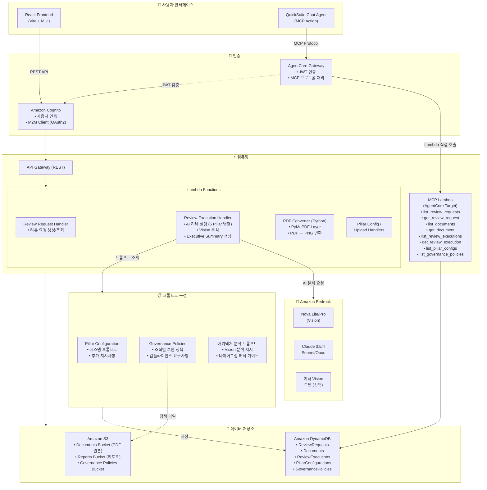

# Architecture Review System

AWS Well-Architected Framework 기반의 AI 아키텍처 리뷰 시스템

## 목차
1. [프로젝트 개요](#프로젝트-개요)
2. [주요 기능](#주요-기능)
3. [기술 스택](#기술-스택)
4. [시작하기](#시작하기)
5. [개발 가이드](#개발-가이드)
6. [배포 가이드](#배포-가이드)
7. [QuickSuite MCP 연동](#quicksuite-mcp-연동)
8. [운영 가이드](#운영-가이드)
9. [리소스 삭제](#리소스-삭제)
10. [트러블슈팅](#트러블슈팅)
11. [CHANGELOG](#changelog)

---

## 프로젝트 개요

### 배경 및 필요성

클라우드 아키텍처 설계는 복잡하고 다양한 관점에서의 검토가 필요합니다. AWS Well-Architected Framework는 6개의 핵심 영역(Pillar)을 통해 아키텍처의 품질을 평가하는 업계 표준 프레임워크이지만, 수동 검토는 시간이 많이 소요되고 전문가 리소스에 의존적입니다.

이 시스템은 **AI 기반 자동화**를 통해 아키텍처 검토 프로세스를 혁신합니다. Amazon Bedrock의 최신 Vision AI 모델을 활용하여 아키텍처 다이어그램을 자동으로 인식하고, 6개 Pillar 관점에서 병렬로 분석하여 **빠르게 종합적인 검토 결과**를 제공합니다.

### 핵심 가치

| 가치 | 설명 |
|------|------|
| ⏱️ **시간 절약** | 수일 걸리던 아키텍처 검토를 수분 내로 단축 |
| 🎯 **일관된 품질** | AWS Well-Architected Framework 기반의 표준화된 검토 기준 적용 |
| 👁️ **시각적 분석** | Vision AI로 아키텍처 다이어그램 자동 인식 및 분석 |
| 🔄 **확장성** | 조직별 거버넌스 정책 및 커스텀 프롬프트 지원 |
| 🤝 **통합성** | QuickSuite Chat Agent 연동으로 대화형 인터페이스 제공 |

### 주요 사용 사례

- **설계 검토**: 신규 아키텍처 설계 시 Well-Architected 관점에서 사전 검토
- **마이그레이션 평가**: 온프레미스에서 클라우드로 이전 시 아키텍처 적합성 평가
- **정기 감사**: 기존 시스템의 주기적인 아키텍처 건강성 점검
- **컴플라이언스 검증**: 조직 보안 정책 및 규정 준수 여부 확인
- **교육 및 학습**: Well-Architected 모범 사례 학습 및 적용

### 시스템 개요

AWS Well-Architected Framework의 6개 Pillar를 기반으로 아키텍처 문서를 자동으로 검토하는 AI 시스템입니다.

### 아키텍처 다이어그램



#### 데이터 흐름 설명

| 경로 | 설명 |
|------|------|
| **Web UI 경로** | React Frontend → Cognito 인증 → API Gateway → Lambda Functions |
| **Chat Agent 경로** | QuickSuite Chat Agent → AgentCore Gateway → MCP Lambda (직접 호출) |
| **AI 리뷰 처리** | Review Execution Handler → 프롬프트 구성 조회 → Amazon Bedrock 분석 |
| **프롬프트 구성** | Pillar별 시스템 프롬프트 + 거버넌스 정책 + 아키텍처 분석 프롬프트 결합 |
| **데이터 저장** | Lambda → S3 (문서/리포트/정책) + DynamoDB (메타데이터/설정) |

### 주요 특징
- 🤖 **AI 기반 검토**: Amazon Bedrock의 다양한 Vision 모델 지원
- 🎯 **6개 Pillar 검토**: 운영 우수성, 보안, 안정성, 성능, 비용, 지속가능성
- 📊 **Vision 분석**: PDF 다이어그램 자동 인식 및 분석
- 📝 **자동 리포트**: PDF/Word 형식 리포트 생성
- ⚡ **성능 최적화**: 수분 내 검토 완료

---

## 주요 기능

### 1. Vision 모델 선택
다양한 AI 모델 중 선택 가능:
- **Amazon Nova Lite/Pro**: 빠르고 저렴, 한글 우수
- **Amazon Nova 2 Lite**: 최신 2세대, 향상된 성능
- **Mistral Pixtral Large**: 대용량 컨텍스트
- **Claude Sonnet 3.5/4.5**: 균형잡힌 성능
- **Claude Opus 4.5**: 최고 품질

### 2. 아키텍처 다이어그램 분석
- PDF에서 아키텍처 다이어그램 자동 인식
- Vision AI로 다이어그램 상세 분석
- AWS 서비스, 데이터 흐름, 보안 구성 파악

### 3. 6개 Pillar 검토
각 Pillar별 전문 AI 에이전트가 병렬로 검토:
- 운영 우수성 (Operational Excellence)
- 보안 (Security)
- 안정성 (Reliability)
- 성능 효율성 (Performance Efficiency)
- 비용 최적화 (Cost Optimization)
- 지속 가능성 (Sustainability)

### 4. Executive Summary
- 아키텍처 다이어그램 분석 요약
- 영역별 주요 발견사항
- 우선순위별 조치 사항
- 기대 효과

### 5. 리포트 생성
- PDF/Word 형식 다운로드
- 마크다운 렌더링
- 버전 관리

---

## 기술 스택

### Frontend
- React 18 + TypeScript
- Material-UI (MUI)
- Vite
- AWS Amplify (인증)
- Axios

### Backend
- AWS Lambda (Node.js 20)
- TypeScript
- Amazon Bedrock (Vision AI)
- Python Lambda (PyMuPDF)

### Infrastructure
- AWS CDK
- Amazon S3 (문서 저장)
- DynamoDB (메타데이터)
- Amazon Cognito (인증)
- API Gateway (REST API)

---

## 시작하기

### 사전 요구사항
- Node.js 18 이상
- Python 3.11 이상
- AWS CLI 설정 완료
- AWS CDK CLI: `npm install -g aws-cdk`

### 프로젝트 다운로드

```bash
# Git Clone (SSH - 권장)
git clone git@github.com:IncheolRoh/well-architected-review-using-bedrock-with-quicksuite-chat-embeding.git
cd well-architected-review-using-bedrock-with-quicksuite-chat-embeding

# Git Clone (HTTPS)
git clone https://github.com/IncheolRoh/well-architected-review-using-bedrock-with-quicksuite-chat-embeding.git
cd well-architected-review-using-bedrock-with-quicksuite-chat-embeding
```

> 💡 HTTPS 방식은 GitHub 토큰 인증이 필요할 수 있습니다. SSH 키가 설정되어 있다면 SSH 방식을 권장합니다.

### 설치 및 환경 설정

```bash
# 1. 의존성 설치 (각 디렉토리에서 개별 실행)
npm install
npm install --include=dev -w backend
npm install -w frontend
npm install -w infrastructure

# 2. 환경 변수 파일 생성
cp frontend/.env.example frontend/.env
cp backend/.env.example backend/.env
cp infrastructure/.env.example infrastructure/.env
```

> 💡 `-w` 옵션은 npm workspace를 지정합니다. backend는 TypeScript 빌드를 위해 `--include=dev` 옵션이 필요합니다.

### Frontend 개발 서버 실행

```bash
cd frontend
npm run dev
# http://localhost:3000
```

> Backend는 AWS Lambda로 실행되므로 로컬 개발 서버가 필요하지 않습니다.  
> 배포 후 `./scripts/update-env-from-cdk.sh`를 실행하면 환경 변수가 자동 업데이트됩니다.

---

## 배포 가이드

### 1. PyMuPDF Layer 빌드
```bash
cd layers/pymupdf
chmod +x build-layer.sh
./build-layer.sh
cd ../..
```

### 2. Backend Lambda 패키징
```bash
cd backend
npm run build
./prepare-layer.sh  # Lambda Layer 의존성 설치

# Lambda Layer zip 생성
cd layer
zip -r ../lambda-layer/lambda-layer.zip nodejs
cd ..

./package-lambda.sh
cd ..
```

### 3. Infrastructure 배포
```bash
cd infrastructure
cdk bootstrap  # 최초 1회만
cdk deploy --all
cd ..
```

### 4. Frontend 환경 변수 업데이트
```bash
./scripts/update-env-from-cdk.sh
```

### 5. Frontend 빌드 (프로덕션)
```bash
cd frontend
npm run build
# dist/ 폴더를 S3 또는 CloudFront에 배포
```

---

## 개발 가이드

### Pillar 에이전트 구조

각 Pillar 에이전트는 동일한 문서 내용을 받지만, Pillar별 System Prompt에 따라 다른 관점으로 분석합니다.

**입력 데이터** (모든 Pillar 공통):
- **Document Content**: Textract 텍스트 + Vision 다이어그램 분석
- **Images**: 아키텍처 다이어그램 PNG (환경 변수로 제어)
- **System Prompt**: Pillar별 전문 프롬프트
- **Additional Instructions**: 사용자 지정 지시사항

**Pillar별 차이점**:
- ✅ System Prompt (각 Pillar의 전문 영역)
- ✅ 분석 관점 (보안, 비용, 성능 등)
- ❌ 입력 데이터 (동일)

**설정 방법**:
1. http://localhost:3000/agent-config 접속
2. 각 Pillar 탭에서 System Prompt 수정
3. 저장

### Vision 모델 설정

**아키텍처 분석 탭**에서 설정:
- **모델 선택**: 7개 모델 중 선택
  - Amazon Nova Lite/2/Pro
  - Mistral Pixtral Large
  - Claude Sonnet 3.5/4.5
  - Claude Opus 4.5
- **Max Tokens**: 1024-16384 (기본 8192)
- **Temperature**: 0.0-1.0 (기본 0.3)
- **프롬프트**: 분석 지시사항 커스터마이징

**모델 선택 기준**:
- **Nova Lite/2**: 빠르고 저렴, 일반 문서 (77초, $0.144)
- **Nova Pro**: 복잡한 아키텍처 (80초, $0.160)
- **Mistral**: 대용량 문서 (85초, $0.170)
- **Claude Sonnet**: 균형잡힌 품질 (95초, $0.200)
- **Claude Opus**: 최고 품질 (101초, $0.228)

### PyMuPDF Layer (Claude 지원)

Claude 모델은 PDF를 직접 처리할 수 없어 이미지 변환이 필요합니다.

**Layer 빌드**:
```bash
cd layers/pymupdf
chmod +x build-layer.sh
./build-layer.sh
# pymupdf-layer.zip 생성 (23MB)
```

**Python Lambda 함수**:
- 위치: `backend/pdf-converter/lambda_function.py`
- 기능: PyMuPDF로 PDF → PNG 변환
- 입력: S3 경로 또는 Base64
- 출력: Base64 인코딩된 PNG

**동작 방식**:
1. Node.js Lambda가 Python Lambda 호출
2. Python Lambda가 S3에서 PDF 다운로드
3. PyMuPDF로 지정 페이지를 PNG로 변환
4. Base64로 인코딩하여 반환
5. Node.js Lambda가 Claude Vision 분석

---

## QuickSuite MCP 연동

QuickSuite Chat Agent에서 DynamoDB 데이터를 조회할 수 있도록 MCP(Model Context Protocol) 연동을 설정합니다.

### 아키텍처

```
QuickSuite Chat Agent
       │
       ▼
MCP Action (OAuth2 인증)
       │
       ▼
Cognito User Pool (토큰 발급)
       │
       ▼
AgentCore Gateway (MCP 프로토콜)
       │
       ▼
MCP Lambda Function
       │
       ▼
DynamoDB Tables (5개)
```

### 제공되는 MCP 도구 (8개)

| 도구명 | 설명 |
|--------|------|
| `list_review_requests` | 리뷰 요청 목록 조회 |
| `get_review_request` | 특정 리뷰 요청 상세 조회 |
| `list_documents` | 문서 목록 조회 |
| `get_document` | 특정 문서 상세 조회 |
| `list_review_executions` | 리뷰 실행 기록 조회 |
| `get_review_execution` | 특정 리뷰 실행 결과 조회 |
| `list_pillar_configs` | Pillar 설정 조회 |
| `list_governance_policies` | 거버넌스 정책 조회 |

### 설정 단계

#### 1단계: CDK 배포 (MCP Lambda 포함)

```bash
# Backend 빌드 및 패키징
cd backend
npm run build
./package-simple.sh

# CDK 배포
cd ../infrastructure
npx cdk deploy
```

배포 후 MCP Lambda ARN이 출력됩니다:
```
Outputs:
ArchitectureReviewStack.McpServerFunctionArn = arn:aws:lambda:us-east-1:...
```

#### 2단계: Cognito M2M 클라이언트 설정

AgentCore Gateway 인증을 위한 Cognito 설정:

```bash
# 프로젝트 루트에서 실행
./scripts/setup-agentcore-cognito.sh
```

이 스크립트는 다음을 수행합니다:
- Resource Server 생성 (`architecture-review-mcp`)
- M2M App Client 생성 (Client Credentials Grant)
- OAuth Scopes 설정 (`read`, `write`)

설정 정보는 `infrastructure/.env.agentcore`에 저장됩니다.

#### 3단계: AgentCore Gateway 설정

MCP Lambda를 외부에서 호출할 수 있도록 Gateway 설정:

```bash
./scripts/setup-agentcore-gateway.sh
```

이 스크립트는 다음을 수행합니다:
- Gateway IAM Role 생성
- AgentCore Gateway 생성 (MCP 프로토콜)
- Lambda Target 등록 (8개 도구 스키마 포함)
- Cognito JWT 인증 설정

**참고**: AWS CLI `bedrock-agentcore-control` 명령어를 사용합니다.

#### 4단계: QuickSuite MCP Action 등록

QuickSuite 콘솔에서 수동으로 MCP Action을 등록합니다.

1. **QuickSight 콘솔** → Manage QuickSight → Integrations
2. **Add MCP action** 클릭
3. 다음 정보 입력:

| 필드 | 값 |
|------|-----|
| Name | `Architecture Review Data MCP` |
| URL | `infrastructure/.env.agentcore`의 `GATEWAY_URL` 값 |
| Auth Type | `Service authentication (2LO)` |
| Client ID | `infrastructure/.env.agentcore`의 `AGENTCORE_CLIENT_ID` 값 |
| Client Secret | `infrastructure/.env.agentcore`의 `AGENTCORE_CLIENT_SECRET` 값 |
| Token URL | `infrastructure/.env.agentcore`의 `COGNITO_TOKEN_URL` 값 |

**상세 가이드**: `docs/QUICKSUITE-MCP-REGISTRATION.md` 참조

#### 5단계: QuickSuite Space 생성 및 MCP Action 연결

1. **QuickSight 콘솔** → Spaces → Create space
2. 다음 정보 입력:
   - **Space name**: `Architecture Review Space`
   - **Description**: 아키텍처 검토를 위한 작업 공간
3. **Knowledge bases** 섹션에서 S3 Knowledge Base 추가 (선택사항):
   - S3 버킷에 거버넌스 정책 문서가 있는 경우 연결
4. **Actions** 섹션에서:
   - 4단계에서 생성한 `Architecture Review Data MCP` 선택
5. **Create** 클릭

#### 6단계: QuickSuite Chat Agent 생성

1. **QuickSight 콘솔** → Chat agents → Create chat agent
2. **Skip** 클릭 (템플릿 사용 안함)
3. 다음 정보 입력:
   - **Name**: `Architecture Review Agent`
   - **Description**: 아키텍처 리뷰 에이전트
   - **Agent identity**: 
     ```
     당신은 AWS Well-Architected Framework의 6개 영역(운영 우수성, 보안, 안정성, 성능 효율성, 비용 최적화, 지속가능성)을 기반으로 아키텍처를 검토하는 전문 에이전트입니다.
     ```
   - **Persona instructions**: 검토 프로세스 및 출력 형식 정의
4. **Link spaces** 클릭 → 5단계에서 생성한 Space 선택 → **Link**
5. **Link actions** 클릭 → `Architecture Review Data MCP` 선택 → **Link**
6. **Welcome message**: `안녕하세요! 아키텍처 리뷰 에이전트입니다.`
7. **Launch chat agent** 클릭
8. **Agent ID 복사** (URL에서 확인: `.../agents/{AGENT_ID}/`)

#### 7단계: 프론트엔드 Chat Agent 임베딩 설정

6단계에서 복사한 Agent ID를 사용하여 Lambda 환경 변수를 설정합니다.

1. **Lambda 환경 변수 업데이트**:
   ```bash
   # QuickSight Embed Handler Lambda 함수 이름 확인
   QUICKSIGHT_LAMBDA=$(aws lambda list-functions \
     --query "Functions[?contains(FunctionName, 'QuickSightEmbedHandler')].FunctionName" \
     --output text --region us-east-1)

   # Lambda 환경 변수 업데이트
   aws lambda update-function-configuration \
     --function-name "$QUICKSIGHT_LAMBDA" \
     --environment "Variables={
       QUICKSIGHT_ACCOUNT_ID=YOUR_ACCOUNT_ID,
       QUICKSIGHT_AGENT_ARN=arn:aws:quicksight:us-east-1:YOUR_ACCOUNT_ID:agent/YOUR_AGENT_ID,
       QUICKSIGHT_NAMESPACE=default,
       QUICKSIGHT_USER_NAME=YOUR_QUICKSIGHT_USER
     }" \
     --region us-east-1
   ```

2. **프론트엔드에서 Chat Widget 사용**:
   - 우측 하단 채팅 버튼 클릭
   - QuickSuite Chat Agent가 임베딩되어 표시됨

### 설정 확인

```bash
# 설정 정보 확인
cat infrastructure/.env.agentcore

# Gateway 상태 확인
aws bedrock-agentcore-control get-gateway \
  --gateway-identifier $(grep GATEWAY_ID infrastructure/.env.agentcore | cut -d= -f2) \
  --region us-east-1

# Target 목록 확인
aws bedrock-agentcore-control list-gateway-targets \
  --gateway-identifier $(grep GATEWAY_ID infrastructure/.env.agentcore | cut -d= -f2) \
  --region us-east-1
```

### 테스트

QuickSuite Chat Agent에서 다음과 같이 테스트:

```
"아키텍처 리뷰 요청 목록을 보여줘"
"Pillar 설정 목록을 확인해줘"
"리뷰 요청 ID xxx의 상세 정보를 알려줘"
```

### 관련 문서

- `docs/MCP-LAMBDA-SETUP-PLAN.md` - 전체 설정 계획
- `docs/QUICKSUITE-MCP-REGISTRATION.md` - QuickSuite 등록 상세 가이드

---

## 운영 가이드

### 성능 최적화

시스템은 환경 변수로 제어되는 최적화 옵션을 제공합니다.

**환경 변수**:
```typescript
INCLUDE_PILLAR_IMAGES: 'false'              // Pillar 분석에 이미지 제외
GENERATE_EXECUTIVE_SUMMARY_SYNC: 'true'    // Executive Summary 생성
```

**최적화 효과**:
- Nova 선택 시: 161초 → 77초 (52% 단축)
- Claude 선택 시: 106초 → 101초 (5% 단축, 69% 비용 절감)

**상세 가이드**: `docs/OPTIMIZATION-GUIDE.md` 참조

### 최적화 설정 방법

분석 품질 최적화를 위해 환경변수 변경 가능:

**AWS Console** (30초):
1. Lambda → ReviewExecutionFn
2. Environment variables 수정
3. Save

**AWS CLI**:
```bash
aws lambda update-function-configuration \
  --function-name [ReviewExecutionFn] \
  --environment "Variables={..., INCLUDE_PILLAR_IMAGES=true}"
```

### 모니터링

**CloudWatch Logs**:
```bash
aws logs tail /aws/lambda/[ReviewExecutionFn] --since 30m --follow
```

**주요 로그**:
- `Analyzing page X with [model]...`
- `[Pillar] Using text model` (최적화 활성화)
- `Executive summary generation skipped` (비동기 모드)

---

## 리소스 삭제

프로젝트에서 생성된 모든 AWS 리소스를 삭제하려면 아래 방법을 사용하세요.

### 자동 삭제 스크립트 (권장)

```bash
# 삭제할 리소스 미리 확인 (실제 삭제 안함)
./scripts/cleanup-resources.sh --dry-run

# 확인 후 삭제 실행
./scripts/cleanup-resources.sh

# 확인 없이 바로 삭제 (CI/CD용)
./scripts/cleanup-resources.sh --force
```

스크립트가 삭제하는 리소스:
- **CDK 스택** (`ArchReview-Minimal`)
  - DynamoDB 테이블 (5개)
  - S3 버킷 (Documents, Reports)
  - Lambda 함수 (10개+)
  - API Gateway
  - Cognito User Pool
- **AgentCore Gateway** (MCP 연동 설정 시)
- **Cognito M2M 클라이언트** (MCP 연동 설정 시)
- **환경 설정 파일** (`infrastructure/.env.agentcore`)

### 수동 삭제

```bash
# 1. CDK 스택 삭제
cd infrastructure
npx cdk destroy ArchReview-Minimal --force

# 2. AgentCore Gateway 삭제 (설정한 경우)
# Gateway ID는 infrastructure/.env.agentcore에서 확인
aws bedrock-agentcore-control delete-gateway \
  --gateway-identifier <GATEWAY_ID> \
  --region us-east-1

# 3. 환경 파일 정리
rm -f infrastructure/.env.agentcore
```

### 주의사항

- ⚠️ **데이터 손실**: 삭제 시 DynamoDB와 S3의 모든 데이터가 영구 삭제됩니다
- 💡 **백업 권장**: 중요한 리뷰 결과는 삭제 전 다운로드하세요
- 🔄 **재배포**: 삭제 후 다시 배포하려면 [배포 가이드](#배포-가이드)를 참조하세요

---

## 트러블슈팅

### PDF 변환 실패

**증상**: "PDF 변환 실패로 Claude 대신 Nova Lite로 분석했습니다"

**원인**: Python Lambda 함수 오류

**해결**:
1. Python Lambda 로그 확인
2. PyMuPDF Layer 확인
3. S3 권한 확인

### Vision 분석 실패

**증상**: "분석 실패: ValidationException"

**원인**: 모델 ID 오류 또는 권한 부족

**해결**:
1. Bedrock 모델 접근 권한 확인
2. 모델 ID 확인 (inference profile 사용)
3. 리전 확인

### 느린 실행 시간

**증상**: 2분 이상 소요

**원인**: 최적화 비활성화

**해결**:
1. 환경 변수 확인
2. `INCLUDE_PILLAR_IMAGES=false` 설정
3. CloudWatch Logs에서 병목 확인

---

## CHANGELOG


---

## 라이선스

MIT

---

## 문의

프로젝트 관련 문의사항은 이슈를 등록해주세요.
